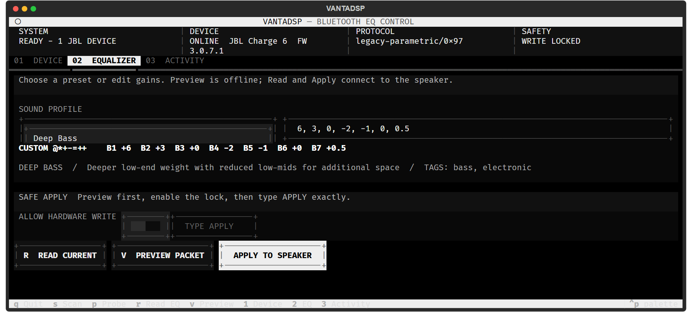

# VantaDSP

VantaDSP is a safety-first Python toolkit and monochrome terminal interface for inspecting and controlling EQ on speakers supported by JBL Portable. It was built from static analysis of JBL Portable 6.9.12 and hardware validation, without modifying the original APK.

> Independent interoperability project. Not affiliated with or endorsed by JBL or Harman. All trademarks belong to their owners. Do not commit or redistribute APK or firmware files with this repository.



## Highlights

- Clean monochrome TUI with device discovery, model-aware EQ, live status, visible version/build identity, packet preview, and activity logs
- BLE scan, advertisement/manufacturer-data inspection, and full GATT service discovery
- Automatic JBL model/PID detection from Harman advertisement bytes, service UUIDs, names, and Windows paired metadata
- Harman/JBL BLE GATT and Bluetooth Classic SPP transports
- Legacy simple, advanced-level, and parametric EQ codecs
- Protocol 4 `0E02` parametric and Grip-style `0E7F` quantized EQ codecs
- PID-based automatic protocol routing across 37 catalogued models
- 24 curated sound profiles mapped to each model's band layout and quantization
- Read-only multi-generation probing, raw packet capture/decoding, and expert packet transmission
- Verified writes with protocol acknowledgement, automatic EQ read-back, per-band comparison, and detailed transaction logs
- CLI dry-run by default, direct TUI apply, target hashing, and JSONL audit logs

## Install

Install the latest release from PyPI:

```powershell
python -m pip install vantadsp
```

PyPI installations check for updates in the background when `vantatui` starts. A newer release is installed with the same Python interpreter, and Activity reports that a restart is required. Editable development installs are never overwritten automatically. Manual commands are also available:

```powershell
vantactl check-update
vantactl update
```

To install from a cloned repository instead:

```powershell
python -m pip install .
```

For development, use an editable installation with the QA toolchain:

```powershell
py -m venv .venv
.venv\Scripts\Activate.ps1
python -m pip install -e ".[dev]"
```

Launch the TUI:

```powershell
vantatui
```

The interface provides DEVICE, EQUALIZER, and ACTIVITY workspaces, plus a detailed SYSTEM / DEVICE / PROTOCOL status strip. `APPLY TO SPEAKER` reads the state before writing, writes after model and gain validation, checks the acknowledgement, reads the EQ again, and reports `WRITE VERIFIED` only when the acknowledgement is accepted and every decoded band matches. It distinguishes `CHANGED + VERIFIED` from `ALREADY MATCHED + VERIFIED`. Activity opens automatically and records the transaction ID, route, target fingerprint, before/write/after TX/RX frames, decoded responses, requested and actual gains, per-band deltas, elapsed time, and failure stage. Audit records store a hash of the target instead of its Bluetooth address.

Runtime configuration and audit files are stored under `%LOCALAPPDATA%\vantadsp\` on Windows. Bluetooth must be enabled, and Windows must permit desktop apps to use Bluetooth and location. For SPP, pair the speaker first and locate its outgoing COM port in Device Manager.

## Safe workflow

Close JBL Portable on nearby phones first so it does not compete for the connection.

```powershell
vantactl scan
vantactl services --address DEVICE_FROM_SCAN
vantactl probe --address DEVICE_FROM_SCAN
vantactl models
vantactl models 20e3
vantactl check-update
```

Known default BLE values extracted from the APK:

```text
service  65786365-6C70-6F69-6E74-2E636F6D0000
RX       65786365-6C70-6F69-6E74-2E636F6D0001
TX       65786365-6C70-6F69-6E74-2E636F6D0002
```

Some products derive a service UUID from PID/MID. Use `services` to discover it, then pass `--service`, `--rx`, and `--tx` overrides if necessary.

Read legacy and Protocol 4 EQ without changing the speaker:

```powershell
vantactl get-simple --address DEVICE
vantactl get-advanced --address DEVICE
vantactl get-p4-eq --address DEVICE
```

## EQ and sound profiles

Mutating commands only print the encoded TX packet unless `--apply` is supplied. The recommended path is PID-aware routing:

```powershell
vantactl set-auto --pid 20e3 5 3 -2.5 -3 -2 -.5 1
vantactl set-profile --pid 20e3 bass
vantactl set-profile --pid 20e3 clear --address DEVICE --apply
vantactl profiles
```

`set-auto` chooses legacy simple, advanced-level, legacy parametric, Protocol 4 `0E02`, or Grip-style `0E7F` from the APK-derived model profile. It refuses products for which the APK does not declare EQ support.

Included profiles cover Flat, Balanced, Bass Heavy, Deep Bass, Punch Bass, Warm, Loudness, Crystal Clear, Bright, Detail Monitor, Vocal, Podcast, Acoustic, Rock, Metal, Hip-Hop, EDM, Pop, Jazz, Classical, Cinema, Gaming, Outdoor, and Night. See [Sound profiles](docs/PROFILES.md).

Examples for direct codec control:

```powershell
# Legacy 3-band signed levels
vantactl set-simple --bass 4 --mid 1 --treble -1

# Legacy advanced signed levels
vantactl set-levels 3 2 1 0 -1 -2 -3

# Legacy parametric bands: type,frequency,gain,q
vantactl set-parametric `
  "low-shelf,125,3,0.7" `
  "peaking,250,2,2" `
  "peaking,500,0,2" `
  "peaking,1000,-1,2" `
  "peaking,2000,0,2" `
  "peaking,4000,1,2" `
  "high-shelf,8000,2,0.7"

# Charge 6 custom-band order: 125, 250, 500, 1k, 2k, 4k, 8kHz
vantactl set-charge6 5 3 -2.5 -3 -2 -.5 1
```

Filter types are `low-shelf`, `peaking`, `high-shelf`, `low-pass`, and `high-pass`. Charge 6 custom band 1 supports -9..+6 dB with asymmetric negative quantization; bands 2-7 support -6..+6 dB in 0.5 dB steps, matching the APK UI mapping.

## Capture, decode, and expert mode

```powershell
vantactl listen --address DEVICE --seconds 15 --log capture.log
vantactl decode "AA9800"
vantactl raw "AA6C00"
vantactl raw "AA6C00" --address DEVICE --apply --i-understand
```

Raw transmission requires both `--apply` and `--i-understand`. No OTA, authentication bypass, factory reset, destructive command, or amplifier/limiter overclock path is implemented.

For Bluetooth Classic SPP, use an outgoing COM port instead of a BLE address:

```powershell
vantactl raw "AA6C00" --port COM7 --apply --i-understand
```

## Python API

```python
from vantadsp.protocol import build_simple_eq_set, parse_legacy_frame

packet = build_simple_eq_set(bass=4, mid=1, treble=-1)
frame = parse_legacy_frame(packet)
print(packet.hex(), frame)
```

Protocol builders perform no Bluetooth I/O, so they are deterministic and reusable. Real transmission is isolated in `vantadsp.transport`; applications should retain an explicit safety confirmation layer.

## Documentation

- [Protocol reference](docs/PROTOCOL.md)
- [Supported models](docs/SUPPORTED_MODELS.md)
- [Hardware-confirmed Charge 6 profile](docs/DEVICE_CHARGE6_20E3.md)
- [Sound profiles](docs/PROFILES.md)
- [Security and QA audit](docs/AUDIT.md)

## Quality assurance

```powershell
ruff format --check .
ruff check .
mypy src/vantadsp
pytest
bandit -q -c pyproject.toml -r src/vantadsp
pip-audit .
python -m build
twine check dist/*
```

GitHub Actions tests Windows and Linux on Python 3.10 and 3.12 with coverage, linting, typing, security, and package validation. APK/XAPK files, decompilation output, captures, local configuration, and audit logs are excluded from version control.
