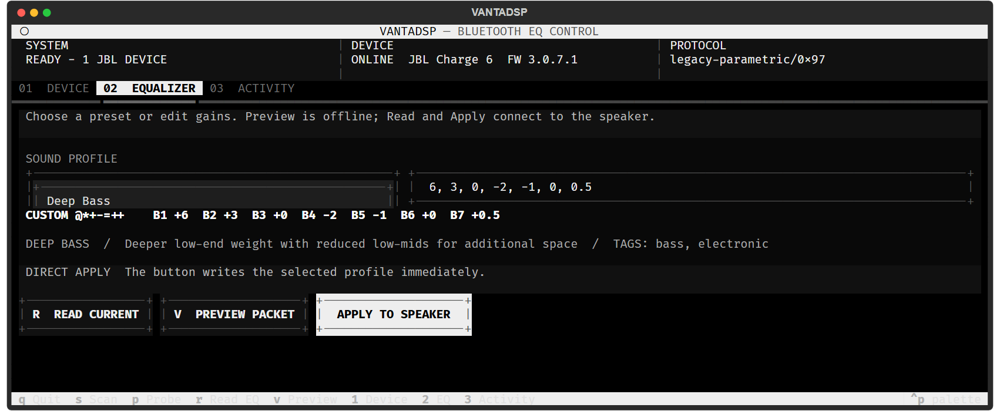
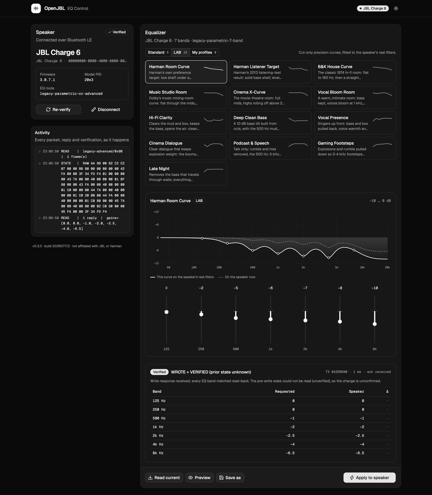

# OpenJBL

Control the EQ on your JBL speaker from Windows, with a terminal UI or a CLI.

Every write is read back and compared band by band, so the tool tells you what
the speaker actually did rather than what it was asked to do.

> Independent interoperability project, built from static analysis of JBL
> Portable 6.9.12 and hardware validation. Not affiliated with or endorsed by
> JBL or Harman. All trademarks belong to their owners. Do not commit or
> redistribute APK or firmware files with this repository.



## Quick start

```powershell
python -m pip install openjbl
openjbl-tui
```

Press **SCAN**. It finds the strongest JBL nearby, connects, verifies the EQ
route, and opens the Equalizer. Pick a profile, press **APPLY TO SPEAKER**.

Close JBL Portable on any phone nearby first, or it will compete for the
connection.

Prefer a desktop window? The GUI is the same verified path with a black-and-white
shadcn/ui front end, a live response curve drawn from the speaker's real filters,
and per-band sliders:

```powershell
python -m pip install "openjbl[gui]"
openjbl-gui
```



It opens in your browser at `http://127.0.0.1:47800/` (the next free port if that one is taken; the Terminal window prints the address). The server listens on
loopback only, and every API call needs a per-launch token that only the page it
served can read, so other sites open in the same browser cannot reach the speaker.
On macOS, start it from Terminal (or `run-openjbl-gui.command`) so the system can
grant Bluetooth access. Run one of the TUI or the GUI at a time: both hold the
speaker's link.

Prefer the command line?

```powershell
openjbl scan                              # find your speaker
openjbl probe --address DEVICE_FROM_SCAN  # read-only: what does it support?
openjbl set-profile --pid 20e3 bass       # prints the packet, sends nothing
openjbl set-profile --pid 20e3 bass --address DEVICE --apply
```

## What it does

| | |
|---|---|
| **Discovery** | BLE scan with automatic JBL model/PID detection from Harman advertisement bytes, service UUIDs, names, and Windows paired metadata |
| **Protocols** | Legacy simple, advanced-level and parametric EQ; Protocol 4 `0E02` parametric; Grip-style `0E7F` quantized. Routed automatically from the PID across 37 catalogued models |
| **Profiles** | 18 curated curves, one per job, plus your own saved ones |
| **Evidence** | Read-back verification, per-band comparison, protocol acknowledgement checks, and JSONL audit logs |
| **Transports** | BLE GATT, and Bluetooth Classic SPP over a COM port |

## Safety

This writes to hardware you own, so the defaults are conservative.

- **The CLI sends nothing without `--apply`.** Mutating commands print the
  encoded packet and stop.
- **The EQ stays locked until a speaker is verified.** A live BLE connection has
  to answer with a supported EQ response first. Cached Windows pairing metadata
  never unlocks it, and changing the address or model locks it again.
- **Verification means the exact link that was probed.** If it drops and
  reconnects, authorisation is revoked rather than carried over.
- **Gains outside the model's own UI range are refused** unless you pass
  `--allow-extended`, and the TUI asks a second time before writing a boost past
  it.
- **Nothing is installed automatically.** The TUI can check PyPI and tell you a
  release exists; `openjbl update` installs it when you ask.
- No OTA, authentication bypass, factory reset, or limiter-overclock path is
  implemented.

### What "verified" means

`APPLY TO SPEAKER` reads the EQ **before** writing, writes, checks the
acknowledgement, then reads it **again** and compares every band. It reports
`WRITE VERIFIED` only when the acknowledgement was accepted and every decoded
band matches.

It distinguishes `CHANGED + VERIFIED` from `ALREADY MATCHED + VERIFIED`, and
says the latter only when the pre-write state was actually decoded -- if it was
not, it says so instead of guessing.

Activity records the transaction ID, route, before/write/after frames, decoded
responses, requested and actual gains, per-band deltas, elapsed time, and the
failure stage. Audit records store a hash of the target, not its address.

## Sound profiles

Run `openjbl profiles` for the full list, or see [Sound profiles](docs/PROFILES.md).

**5 standard** -- inside each model's own UI range, so they work on every EQ
model and need no confirmation: Flat, Balanced, Bass Heavy, Vocal Focus, Outdoor.

**13 LAB** -- beyond the UI range, needing `--allow-extended`. A room family of
published in-room targets: Harman Room Curve, Harman Listener Target (Olive
2013), B&K House Curve (1974), Music Studio Room (Dolby Atmos Music), Cinema
X-Curve (SMPTE ST 202) and Vocal Bloom Room. Then one per job: Hi-Fi Clarity,
Deep Clean Bass, Vocal Presence, Cinema Dialogue, Podcast & Speech, Gaming
Footsteps, Late Night. All of them only cut. A large
boost has to come out of the DSP's headroom and the speaker's limiter, so it
distorts and then gets quieter; a cut costs level, which the volume knob gives
back. Each curve was fitted against the Charge 6's real filter chain rather than
picked band by band. A boost typed in by hand is labelled `DANGER` and needs a
second confirmation.

**My profiles** -- edit the gains, press `SAVE AS`, name it. Stored as a
seven-point tonal curve, so a profile saved on one speaker still means something
on a model with a different band count.

```powershell
openjbl save-profile --name "Living Room" --pid 20e3 --gains 5 2 0 -1 -2 0 3
openjbl profiles --mine
openjbl delete-profile --key user-living-room
```

## Command reference

### Read-only

```powershell
openjbl scan                                  # BLE advertisements + Windows paired JBLs
openjbl services --address DEVICE             # GATT services and characteristics
openjbl probe --address DEVICE                # which EQ generation does it speak?
openjbl models                                # the APK's model/PID database
openjbl models 20e3
openjbl get-simple  --address DEVICE          # read the EQ, change nothing
openjbl get-advanced --address DEVICE
openjbl get-p4-eq   --address DEVICE
openjbl check-update
```

### Writing EQ

`set-auto` picks the wire format from the PID and refuses products the APK
declares no EQ support for. It is the recommended path.

```powershell
openjbl set-auto --pid 20e3 5 3 -2.5 -3 -2 -.5 1
openjbl set-profile --pid 20e3 bass --address DEVICE --apply
```

Direct codec control, for when you know exactly what you want:

```powershell
# Legacy 3-band signed levels
openjbl set-simple --bass 4 --mid 1 --treble -1

# Legacy advanced signed levels
openjbl set-levels 3 2 1 0 -1 -2 -3

# Legacy parametric bands: type,frequency,gain,q
openjbl set-parametric --category custom_c2 `
  --band "low_shelf,125,3,0.707" `
  --band "peaking,250,2,2" `
  --band "peaking,500,0,2" `
  --band "peaking,1000,-1,2" `
  --band "peaking,2000,0,2" `
  --band "peaking,4000,1,2" `
  --band "high_shelf,8000,2,0.707"

# Charge 6 custom-band order: 125, 250, 500, 1k, 2k, 4k, 8 kHz
openjbl set-charge6 5 3 -2.5 -3 -2 -.5 1
```

Filter types: `low_shelf`, `peaking`, `high_shelf`, `low_pass`, `high_pass`.

Charge 6 custom band 1 takes -9..+6 dB with asymmetric negative steps; bands 2-7
take -6..+6 dB in 0.5 dB steps, matching the APK's UI mapping.

### Capture and expert mode

```powershell
openjbl listen --address DEVICE --seconds 15 --log capture.log
openjbl decode "AA980000"
openjbl raw "AA6C00"                                      # prints only
openjbl raw "AA6C00" --address DEVICE --apply --i-understand
openjbl raw "AA6C00" --port COM7 --apply --i-understand   # Classic SPP
```

Raw transmission needs both `--apply` and `--i-understand`.

## Python API

```python
from openjbl.protocol import describe_frame, set_simple_eq

packet = set_simple_eq(category=0xC1, bass=4, mid=1, treble=-1)
print(packet.hex(), describe_frame(packet))
```

Protocol builders do no Bluetooth I/O, so they are deterministic and reusable.
Transmission is isolated in `openjbl.connection`; keep your own confirmation
layer in front of it.

## Setup notes

Bluetooth must be on, and Windows must allow desktop apps to use Bluetooth and
location. Configuration, saved profiles and audit logs live in
`%LOCALAPPDATA%\openjbl\`.

The default BLE UUIDs, extracted from the APK:

```text
service  65786365-6C70-6F69-6E74-2E636F6D0000
RX       65786365-6C70-6F69-6E74-2E636F6D0001
TX       65786365-6C70-6F69-6E74-2E636F6D0002
```

Some products derive their service UUID from PID/MID. Run `services` to find it,
then pass `--service`, `--rx` and `--tx`.

For SPP, pair the speaker first and find its outgoing COM port in Device
Manager.

## Install from source

```powershell
python -m pip install .
```

For development, with the QA toolchain:

```powershell
py -m venv .venv
.venv\Scripts\Activate.ps1
python -m pip install -e ".[dev]"
```

The GUI's front end lives in `gui/` (Vite, React, Tailwind, shadcn/ui). The built
page is committed under `src/openjbl/web/`, so installing the package needs no
Node toolchain. To change it:

```powershell
cd gui
npm install
npm run build        # writes src/openjbl/web/
```

For live reload, run `openjbl-gui --no-browser` with `OPENJBL_GUI_TOKEN` set, and
`npm run dev` in `gui/` with the same value in `VITE_OPENJBL_TOKEN`.

`tests/test_gui_e2e.py` opens the built page in headless Chrome and clicks through
it against a simulated speaker. It needs `python -m pip install -e ".[e2e]"` and
Google Chrome, and skips itself without them.

## Documentation

- [Protocol reference](docs/PROTOCOL.md)
- [Supported models](docs/SUPPORTED_MODELS.md)
- [Hardware-confirmed Charge 6 profile](docs/DEVICE_CHARGE6_20E3.md)
- [Sound profiles](docs/PROFILES.md)
- [Security and QA audit](docs/AUDIT.md)

## Quality assurance

```powershell
ruff format --check .
ruff check .
mypy src/openjbl
pytest
bandit -q -c pyproject.toml -r src/openjbl
pip-audit .
python -m build
twine check dist/*
```

GitHub Actions runs Windows and Linux on Python 3.10 and 3.12 with coverage,
linting, typing, security and package validation. APK/XAPK files, decompiler
output, captures, local configuration and audit logs are excluded from version
control.
